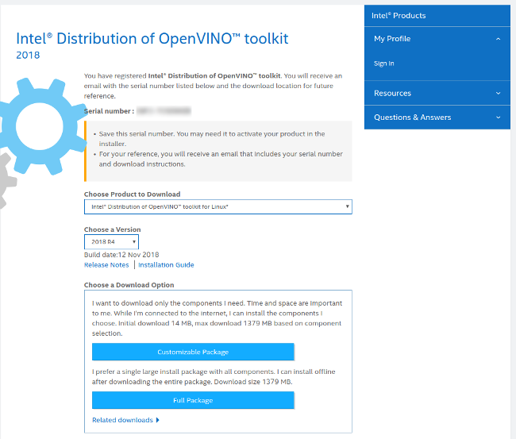

# Restricted Zone Notifier

| Details            |              |
|-----------------------|---------------|
| Target OS:            |  Ubuntu\* 16.04 LTS   |
| Programming Language: |  Google Go* Programming Language |
| Time to Complete:    |  45 min     |


## Introduction

This restricted zone notifier application is one of a series of reference implementations for Computer Vision (CV) using the Intel® Distribution of OpenVINO™ toolkit written in the Google Go* programming language. This example is designed for a machine mounted camera system that monitors if there are any humans present in a predefined selected assembly line area. It sends an alert if there is at least one person detected in the marked assembly area. The user can select the area coordinates using command line parameters or by pressing the `ESC` key to activate the region of interest (ROI) once the application has been started. Pressing the `ESC` key pauses the application and invokes a separate window onto which the user can drag the mouse from the upper left ROI corner to lower right, creating a bounding box. By default the entire frame is selected.

This example demonstrates how to use CV to improve assembly line safety for human operators and factory workers.

## Requirements

### Hardware

* 6th Generation Intel® Core™ processor with Intel® Iris® Pro graphics and Intel® HD Graphics

### Software

* [Ubuntu\* 16.04 LTS](http://releases.ubuntu.com/16.04/)
Run kernel versions 4.7+ to use this software. We recommend using a 4.14+ kernel to use this software. 
Determine the kernel version with the uname command in a shell: 

```shell
uname -a
```

* OpenCL™ Runtime Package
* Intel® Distribution of OpenVINO™ toolkit
* Go programming language v1.11+

## Setup

### Install Intel® Distribution of OpenVINO™ toolkit

Refer to [Install the Intel® Distribution of OpenVINO™ toolkit for Linux*](https://software.intel.com/en-us/articles/OpenVINO-Install-Linux) for more information about how to install and setup the Intel® Distribution of OpenVINO™ toolkit.

The software requires the installation of OpenCL™ Runtime package to run inference on the GPU, as indicated in the following instructions. It is not mandatory for CPU inference.

### Install Go

Install the Go programming language version 1.11+ in order to compile this application. Obtain the latest compiler from the Go website's [download page.](https://golang.org/dl/)

For an excellent introduction to the Go programming language, see the [online tour.](https://tour.golang.org)

### Download the Reference Platform Code

Download the reference platform code onto your computer by using the "go get" command:

```shell
go get -d github.com/intel-iot-devkit/restricted-zone-notifier-go
```

Change the current directory to the location where the application code is installed: 

```shell
cd $GOPATH/src/github.com/intel-iot-devkit/restricted-zone-notifier-go
```

### Install Dependency Tool

This sample uses the `dep` dependency tool for Go. Download and install the tool:

```shell
make godep

```

### Install GoCV

After installing Go, install the [GoCV package](https://gocv.io/) which contains the Go programming language wrappers for Intel® Distribution of OpenVINO™ toolkit and the associated dependencies. The `dep` tool satisfies the program's dependencies as defined in `Gopkg.lock` file. To run, use:

```shell
make dep
```

Now you should be ready to build and run the reference platform application code.

## How It Works

The application uses a video source, such as a camera, to grab frames, and then uses Deep Neural Networks (DNNs) to process the data.
The network detects persons in the frame, and if successful, it checks if the detected persons are in the indicated off-limits assembly line region.

Optionally data can be sent to a MQTT machine to machine messaging server, as part of an industrial data analytics system.

This application uses a DNN model optimized for Intel® architecture. The model is part of the Intel® Distribution of OpenVINO™ toolkit.

Find the optimized models here:

- `/opt/intel/computer_vision_sdk/deployment_tools/intel_models/pedestrian-detection-adas-0002`


The program creates three goroutines for concurrency:

- Main goroutine that performs the video i/o
- Worker goroutine that processes video frames using the deep neural networks
- Worker goroutine that publishes MQTT messages to remote server

## Set the Build Environment

Configure the environment to use the Intel® Distribution of OpenVINO™ toolkit one time per session:

```shell
source /opt/intel/computer_vision_sdk/bin/setupvars.sh
```

## Build the Code

Change the current directory to the location of the git-cloned application code. For example:

```shell
cd $GOPATH/src/github.com/intel-iot-devkit/restricted-zone-notifier-go
```

Before building the program, obtain its dependencies by running the commands below. The first one fetches `Go` depedency manager of our choice and the second uses it to satisfy the program's depdencies as defined in `Gopkg.lock` file:

```shell
make godep
make dep
```
After fetching dependencies, export a few environment variables required to build the library from the fetched dependencies. Run the  source command from the project directory:

```shell
source vendor/gocv.io/x/gocv/openvino/env.sh
```

To build the program binary, the project ships a simple `Makefile`. Invoke the `build` task from the project root as follows:

```shell
make build
```
This commands creates a new directory called `build` in your current working directory and places the newly built binary called `notifier` into it.

## Run the Code

To see a list of the various options:

```shell
cd build
./notifier -help
```

To run the application with the needed model using the webcam, use:

```shell
./notifier -model=/opt/intel/computer_vision_sdk/deployment_tools/intel_models/pedestrian-detection-adas-0002/FP32/pedestrian-detection-adas-0002.bin -model-config=/opt/intel/computer_vision_sdk/deployment_tools/intel_models/pedestrian-detection-adas-0002/FP32/pedestrian-detection-adas-0002.xml
```

Select an area to be used as the "off-limits" area by pressing the `c` key once the program is running. A new window will open showing a still image from the video capture device. Drag the mouse from left top corner to cover an area on the plane and once done (a blue rectangle is drawn) present `ENTER` or `SPACE` to proceed with notifiering.

Afte the "off-limits" area has been selected, the coordinates will be displayed in the terminal window like this:

```shell
Restricted Zone: -x=429 -y=101 -height=619 -width=690
```

Run the application using those coordinates by using the `-x`, `-y`, `-height`, and `-width` flags to pre-select that area.

For example:

```shell
./notifier -model=/opt/intel/computer_vision_sdk/deployment_tools/intel_models/pedestrian-detection-adas-0002/FP32/pedestrian-detection-adas-0002.bin -model-config=/opt/intel/computer_vision_sdk/deployment_tools/intel_models/pedestrian-detection-adas-0002/FP32/pedestrian-detection-adas-0002.xml -x=429 -y=101 -height=619 -width=690
```

The reference implementation uses the entire window as the off-limits area by default. Select an area if this is not the desired behavior.


### Hardware Acceleration

This application can take advantage of the hardware acceleration in the Intel® Distribution of OpenVINO™ toolkit by using the `-backend, -b` and `-target, -t` parameters.

For example, to use the Intel® Distribution of OpenVINO™ toolkit backend with the GPU in 32-bit mode:

```shell
./notifier -model=/opt/intel/computer_vision_sdk/deployment_tools/intel_models/pedestrian-detection-adas-0002/FP32/pedestrian-detection-adas-0002.bin -model-config=/opt/intel/computer_vision_sdk/deployment_tools/intel_models/pedestrian-detection-adas-0002/FP32/pedestrian-detection-adas-0002.xml -backedn=2 -target=1
```

To run the code using 16-bit floats, set both the `-target` flag to use the GPU in 16-bit mode, as well as use the FP16 version of the Intel® models:

```shell
./notifier -model=/opt/intel/computer_vision_sdk/deployment_tools/intel_models/pedestrian-detection-adas-0002/FP16/pedestrian-detection-adas-0002.bin -model-config=/opt/intel/computer_vision_sdk/deployment_tools/intel_models/pedestrian-detection-adas-0002/FP16/pedestrian-detection-adas-0002.xml -backend=2 -target=2
```

To run the code using the VPU, set the `-target` flag to `3` and also use the 16-bit FP16 version of the Intel® models:

```shell
./notifier -model=/opt/intel/computer_vision_sdk/deployment_tools/intel_models/pedestrian-detection-adas-0002/FP16/pedestrian-detection-adas-0002.bin -model-config=/opt/intel/computer_vision_sdk/deployment_tools/intel_models/pedestrian-detection-adas-0002/FP16/pedestrian-detection-adas-0002.xml -backend=2 -target=3
```

## Sample Videos

There are several sample videos that can be used to demonstrate the capabilities of this application. Download them by running these commands from these commands from the `restricted-zone-notifier-go` directory:

```shell
mkdir resources
cd resources
wget https://github.com/intel-iot-devkit/sample-videos/raw/master/worker-zone-detection.mp4
cd ..
```

To execute the code using one of these sample videos, run the following commands from the `restricted-zone-notifier-go` directory:

```shell
cd build
./notifier -model=/opt/intel/computer_vision_sdk/deployment_tools/intel_models/pedestrian-detection-adas-0002/FP32/pedestrian-detection-adas-0002.bin -model-config=/opt/intel/computer_vision_sdk/deployment_tools/intel_models/pedestrian-detection-adas-0002/FP32/pedestrian-detection-adas-0002.xml -input=../resources/worker-zone-detection.mp4 -model-confidence=0.7
```

### Machine to Machine Messaging with MQTT

To use a MQTT server to publish data, set the following environment variables before running the program and use `-publish` flag when launching the program:

```shell
export MQTT_SERVER=localhost:1883
export MQTT_CLIENT_ID=cvservice
```
Change the `MQTT_SERVER` to a value that matches the MQTT server to which you are connected.

Change the `MQTT_CLIENT_ID` to a unique value for each monitoring station to track the data for individual locations. For example:


```shell
export MQTT_CLIENT_ID=zone1337
```

To monitor the MQTT messages sent to your local server, ensure the the `mosquitto` client utilities is installed and run the following command:

```shell
mosquitto_sub -t 'machine/zone'
```

## Docker*

To use the reference implementatino with Docker*, build a Docker image and then run the program in a Docker container. Use the `Dockerfile` present in the cloned repository to build the Docker image.

Follow the registration process for the Intel® Distribution of OpenVINO™ toolkit to obtain a unique download URL. A registration email  will be sent. It contains a link to the Intel Registration Center website download page, shown here:



Navigate to the download page using the link. On the download page, use the "Choose Product to Download" selection box and select "Intel® Distribution of OpenVINO™ toolkit for Linux*". Next, using the "Choose a Version" selection box, select "2018 R5". The "Choose a Download Option" section should appear. Right click on the button "Full Package" and choose "Copy Link Address". The clipboard should now contain a unique download URL. Save this URL somewhere safe.

Now build a unique Docker image by running the following command, substituting the actual URL obtained in the previous step:

```shell
docker build -t restricted-zone-notifier-go --build-arg OPENVINO_DOWNLOAD_URL=[your unique OpenVINO download URL here] .
```

This will produce a Docker image called `restricted-zone-notifier-go` which contains the built binary. Since the built docker image has an [ENTRYPOINT](https://docs.docker.com/engine/reference/builder/#entrypoint) defined, run the image as an executable using the following command:

```shell
docker run -it --rm restricted-zone-notifier-go -h
```

To run the Docker image on an Ubuntu host machine using an attached camera, use:

```shell
xhost +local:docker
docker run --device=/dev/video0:/dev/video0 -v /tmp/.X11-unix:/tmp/.X11-unix -e DISPLAY=$DISPLAY -it --rm restricted-zone-notifier-go 
xhost -local:docker
```

To run the Docker image on an Ubuntu host machine using a file input, use:

```shell
xhost +local:docker
docker run -v ${PWD}/resources:/resources -v /tmp/.X11-unix:/tmp/.X11-unix -e DISPLAY=$DISPLAY -it --rm restricted-zone-notifier-go -input=/resources/face-demographics-walking-and-pause.mp4
xhost -local:docker
```

## Microsoft Azure*
To take advantage of a more advanced build system provided by [Microsoft Azure Cloud](https://azure.microsoft.com/), see the Azure guide [here](./azure.md). Following the steps in the guide to build a Docker container and push it into Azure Container Registry to make it available online.

## Related Reference Implementations

[Restricted Zone Notifier CPP](https://github.com/intel-iot-devkit/restricted-zone-notifier-cpp)

